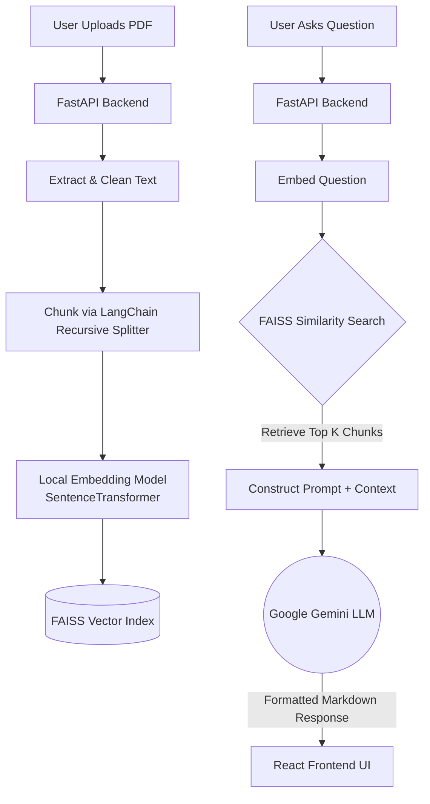

# 🧠 AI Knowledge Assistant (RAG Document Assistant)


An enterprise-grade **Retrieval-Augmented Generation (RAG)** application designed to ingest complex PDF documents (like research papers or technical manuals) and provide accurate, context-aware answers complete with page citations.

Built with a focus on performant vector similarity search and an exceptionally polished user interface.

---

## 🌟 Key Features

* **Context-Aware Insights**: Ask natural language questions and get synthesized answers extracted directly from your uploaded materials.
* **Precise Citations**: Every answer provides exact snippets and page numbers, eliminating AI hallucinations and allowing you to verify sources instantly.
* **Intelligent Query Intent Detection**: Automatically adjusts the chunk retrieval volume based on whether the user asks for a simple fact vs. a comprehensive summary.
* **Privacy & Cost Optimized**: Utilizes local `SentenceTransformers` (`all-MiniLM-L6-v2`) for generating embeddings on the host machine, meaning only the most relevant text chunks are sent to the LLM.
* **Sub-Millisecond Vector Search**: Uses Meta's `FAISS` library for blazingly fast `IndexFlatIP` (Inner Product) similarity search.
* **Premium Glassmorphism UI**: A truly stunning Vite and React application styled with vanilla CSS, featuring dynamic animations and responsive design.

---

## 🏗️ Architecture

The system follows an advanced, locally-embedded RAG pipeline:



---

## 🚀 Quick Start Guide

Follow these steps to run the knowledge assistant on your local machine.

### 1. Backend Setup

The backend handles the RAG pipeline using FastAPI and FAISS.

```bash
# Navigate to backend directory
cd backend

# Create and activate a virtual environment
python -m venv venv
source venv/bin/activate  # On Windows use `venv\Scripts\activate`

# Install dependencies (ensure you have a requirements.txt)
pip install -r requirements.txt

# Create an environment file
echo "GOOGLE_API_KEY=your_gemini_api_key_here" > .env

# Run the FastAPI server
uvicorn main:app --reload --host 0.0.0.0 --port 8000
```
*The backend API will be running on `http://localhost:8000`.*

### 2. Frontend Setup

The frontend is a lightning-fast React application built with Vite.

```bash
# Navigate to frontend directory in a new terminal window
cd frontend

# Install dependencies
npm install

# Start the Vite development server
npm run dev
```
*The stunning UI will be available at `http://localhost:5173`.*

---

## 🧠 Technical Decisions & Challenges

**Why FAISS & Local Embeddings?**
Instead of sending entire documents to costly third-party embedding APIs, this architecture uses `all-MiniLM-L6-v2` to compute dense vectors directly on the CPU. FAISS then indexing enables instantaneous retrieval. This approach proves that high-quality NLP systems can be both cost-efficient and deeply respectful of data privacy.

**A Note on Document Storage (`/uploads`)**
Currently, when a PDF is uploaded, it is sent to a temporary directory (`backend/uploads/`). Once the system successfully extracts and vectorizes the text chunks into the FAISS index, **the original PDF is immediately deleted.**
* **Why this is optimal:** The LLM generator only needs the text chunks and their embeddings to synthesize answers. Deleting the raw PDF saves permanent storage space and reduces data-retention liabilities.

**UI Refinement**
The frontend was deliberately built using Vanilla CSS (instead of highly opinionated frameworks) to demonstrate mastery of core web technologies, responsive layout techniques, and modern aesthetic trends like glassmorphism.

---

## 👨‍💻 Contributing

Contributions are always welcome! Feel free to open an issue or submit a Pull Request if you have ideas on how to improve the query routing or extend the file ingestion beyond PDFs.
